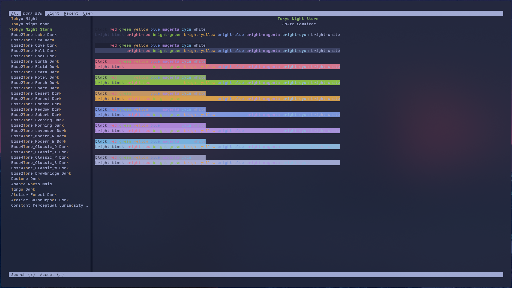

+++
authors = ["Aditya Kumar"]
title = "Meet Kitty: The Terminal Emulator You Didn't Know You Needed"
description = "A friendly introduction to Kitty terminal — what it is, why it stands out from the crowd, and why developers worldwide are making the switch. Perfect for anyone curious about upgrading their terminal experience."
date = 2026-03-10
[taxonomies]
tags = ["linux","terminal","gpu"]
[extra]
banner = "kitty.webp"
archive = true
toc = true
toc_inline = true
toc_ordered = true
trigger = "Dont try Linux.. you will get addicted to it"
+++

# Introduction

I used to hop between three different terminals before settling on one that felt "pretty good enough".Alacritty/foot/st was fast but barebone.iTerm2/ghostty/Wezterm/Warp was feature-rich but bloated.Gnome terminal was just..... there.None of the, felt like they were built for the way I actually work.

Then One day exploring r/unixp*rn reddit page i came accross some desktop hyprland rices which use kitty as terminal emulator.I tried that around 1.5 years ago and I haven't opened another terminal since then apart from tty offcourse.

Kitty is a GPU-accelerated terminal emulator that doesn,t make you choose between speed and features. It renders text using you graphics card,displays actual images right inside the terminal,splits into windows and tab without _tmux_,and has a whole plugin system built in .It sounds likea lot and it is but the wild part is that it never feels bloated.

This beginner friendly blog from a _beginner linux enthusiast_ is for every one who's ever like their terminal was just a black box they tolerated rather than a tool they loved.We are going to wal through everthin kitty offers, from getting it installer to bending it to you exact workflow.No fluff,just the good stuff.

Let's get into it.

# Installation

Alright,let's get into it! before we can explore all the amazing things Kitty can do,we need to get it installed.The good news?It's pretty straightforward no matter which OS you're on.

Let's walk through it together,step by step.

## What you will need before installing

- A _linux_,_macOS_,or _BSD_ system
- A terminal (any one will do for now) or just tty will do the work
- Basic familiarity with running commands
- An internet connection

## Method ONE - The Official Way [Recommended]

The Kitty team provides an official installer script that works on both _linux_ and _macOS_.
This is the easiest and most reliable method.

Just open your current terminal/tty and run:
```bash
curl -L https://sw.kovidgoyal.net/kitty/installer.sh | sh /dev/stdin
```
This will download and install the latest stable version of Kitty directly from the official source.No package manager needed,no outdated versions.

After installation,Kitty will be placed at:
```bash
~/.local/kitty.app/bin/kitty
```

to make it easy to launch from anywhere,add it to your PATH by running:
```bash
sudo ln -sf ~/.local/kitty.app/bin/kitty /usr/bin/kitty
```


Please note that this is Binary install.



## Method TWO - Building from source

I know if you are using linux you have itch to just compile it from source.you only need is your choice of C compiler(gcc/clang) and go compiler.Then clone the kitty's git repo

### Cloneing the git repo of kitty

```bash
git clone https://github.com/kovidgoyal/kitty.git
```

### Moving to that clone dir

```bash
cd kitty
```

### Starting compiling it

```bash
./dev.sh build
```
thiss will compile the kitty to you system.

## Method THREE - Installing via Package Managers

If you prefer using your system's package manager, kitty is available on most major platforms.Here's how to install in on each one:

### For Debain

```bash
sudo apt install kitty
```

### For Arch

```bash
sudo pacman -S kitty
# for git version
# using yay
yay -S kitty-git

#using paru
paru -S kitty-git
```

### For Fedora

```bash
sudo dnf install kitty
```

### For macOS - Homebrew

```bash
brew install ---cask kitty
```

### For FreeBSD
```bash
pkg install kitty
```

## Verifying your Installation

Once installed, let's make sure everything worked.Run this in you terminal:

```bash
kitty --version
```

You should see something like:
```bash
kitty 0.45.0 created by Kovid Goyal
```

If that prints out cleanly, you are good to go.Go ahead and launch it:
```bash
kitty
```

Your first Kitty window will open and honestly - even out of the box with zero configuration - you will notice the difference. The text is sharper, scrolling is smoother,and it just feels snappier that what you are used to.

## Ran into problem?

**Command not found after installing??** your `~/.local/bin` might not be in your PATH.Add this to your `~/.bashrc` or `~/.zshrc` or `~/.config/fish/config.fish`

### for bash
Open bash config using `vim`
```bash
vim ~/.bashrc
```
add this in your ~/.bashrc and and save the file
```bash
export PATH="$HOME/.local/bin:$PATH"
```
then reload the config

```bash
source ~/.bashrc
```

### for zsh
Open zsh config using `vim`
```bash
vim ~/.zshrc
```
add this in your ~/.zshrc and save the file
```bash
export PATH="$HOME/.local/bin:$PATH"
```

then reload the config

```bash
source ~/.zshrc
```

### Fonts looks off?

```bash
macos_thicken_font 0.75
```
Its make noticable difference on Retina Displays.

# Customizing Kitty

One of the best things about Kitty is how easy it is to make it look exactly the way you want.
No GUI settings menu,no clicking around - just a single config file that you edit directly.
Once you get hang of it,it feels suprisingly satisfying.


## Finding Your Config file

Kitty's entire configuration lives in one file:

```bash
~/.config/kitty/kitty.conf
```

If it doesn't exist yet,just create it:

```bash
# making config dir
mkdir -p ~/.config/kitty
# creating kitty.conf
touch ~/.config/kitty/kitty.conf
```

Open it in your favourite editor and you are ready to start customizing.

## Changing the ColorScheme

Kitty uses a straightforward color system.You define colors directly in `kitty.conf` using hex codes.Here's what a basic custom color setup look like:

```bash
# ~/.config/kitty/kitty.conf
# Background and foreground
background #1e1e2e
foreground #cdd6f4

# Cursor
cursor #f5e0dc

# Selection
selection_background #313244
selection_foreground #cdd6f4
```
Simple,clean,and totally in your control.

## Using a premade Theme
Don't have your own colorscheme?? Totally understandable.Kitty has a built-in theme browser that lets you preview and apply hundreds of community-made themes with a single command.

Run this:

```bash
kitty +kitten themes
```

A beautiful interactive menu will pop up right inside your terminal.You can browser and preview themes live, and hit Enter to apply.It's one of those features that makes you go "wait,Thats so easy?"



My themes are;
- catppuccin Mocha
- Tokyo Night
- Dracula
- Gruvbox Dark
- Nord

## Applying Theme Manually

If you already know which theme you want,you can apply it manually by adding an include line to your `kitty.conf`:

First download any theme file of your choice, make sure its follow kitty conf style.

```bash
wget https://raw.githubusercontent.com/catppuccin/kitty/main/themes/mocha.conf
```

move that file to config dir of kitty's config
```bash
cp mocha ~/.config/kitty/
```

and include it in your config:

```bash
include mocha.conf
```

reload Kitty and you are done.

## A Few extra Touches

While you are in the config,here are couple of tweaks that go nicely alongside a new colorscheme:
Change the background opacity for a frosted glass effect:

```bash
background_opacity 0.95
```

You can also add a subtle blur:
```bash
background_blur 10
```

# Fonts in Kitty
Honestly,Fonts are one of the things you dont think about until you change them - and then you can never go back.The right font in your terminal makes code easier to read. reduces eye strain during long sessions,and just make the whole experience feel more polished.
If you are vim/neovim lover then fonts should be your first priority in a terminal.

## Setting Your Font
All font settings live in the same `kitty.conf` file we touched earlier.Setting a font is as simple as:
```conf
font_family       JetBrains Mono
bold_font         auto
italic_font       auto
bold_italic_font  auto
```

The `auto` values tell Kitty to automatically find the bold and italic variants of your chosen font.In most cases this just works without any extra effort.

## Adjusting font Size
finding the right font size is personal.Some people like things big and readable,others want small for more things to be visiable.Start here and tune to your taste:

```conf
font_size     13.5
```

## Best fonts for Kitty
Not all fonts are created equal for terminal use.You want something that is:
- **Monospaced** - every character takes the same width,essential for terminal aligment
- **Highly legiable** - espacially at smaller sizes
- **ligature support** - optional but makes operators like `=>` and `!=` really sleek

Here are some of the most loved fonts in the terminal community right now:

`JetBrains Mono` clean,modern, and designed specifically for code.has excellent ligature support and is incredibly readable at any size.This is the one I personally use and recommend starting with

```conf
font_family JetBrains Mono
```

`FiraCode` The OG ligature font.If you have seen beautiful screenshots of terminals with fancy arrow operators and slick symbols,there is good chance firaCode was involved.

```conf
font_family   FiraCode
```

`Hack` No-nonsense,clean,and built purely for terminals and code editors.If you want something that just gets out of the way and lets you focus,Hack is a great pick.

```conf
font_family   Hack
```

`Cascadia Code` Microslop's own opensource font,orignally built for Windows terminal,suprisingly excellent on Linux and macOS too,with great ligature support.

```conf
font_family     Cascadia Code
```

`Iosevka` Highly customizable and very slim.Great if you want to fit more content on screen without cranking the font size way down.

```conf
font_family   Iosevka
```
